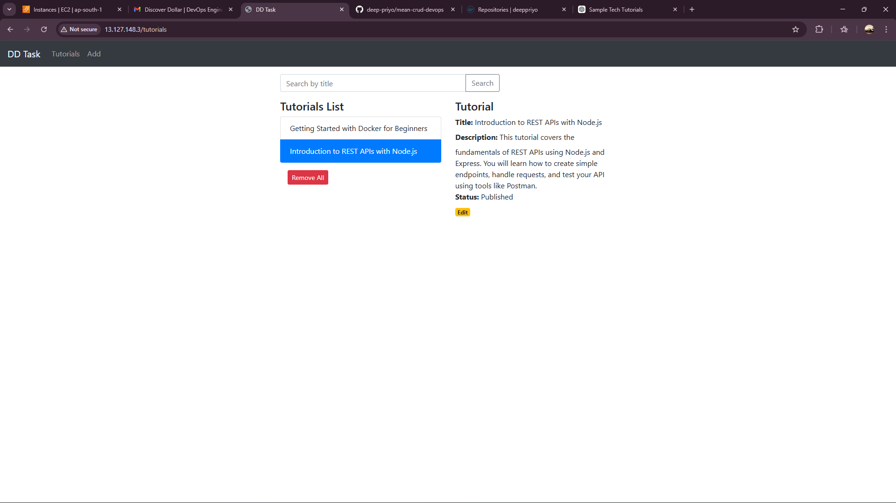
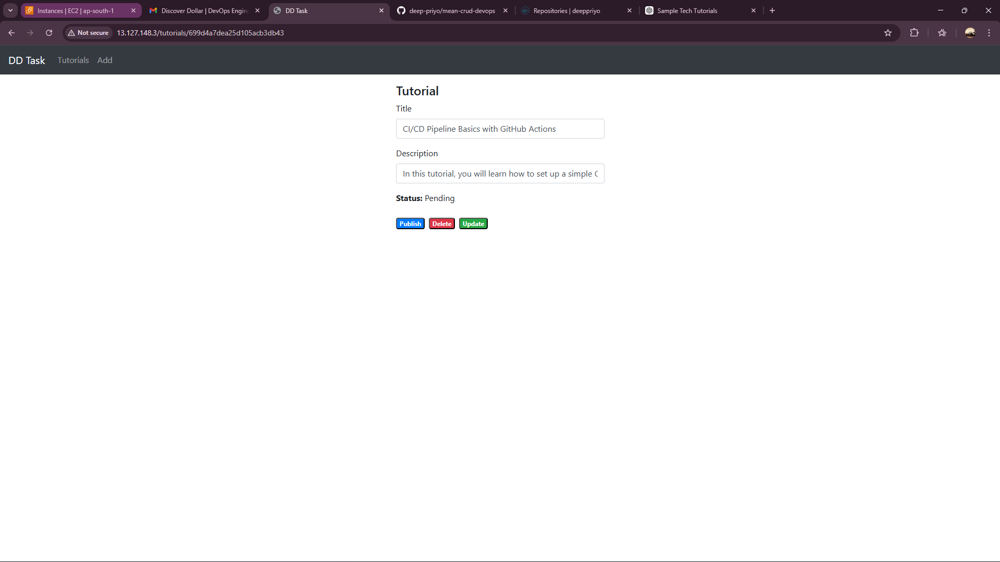
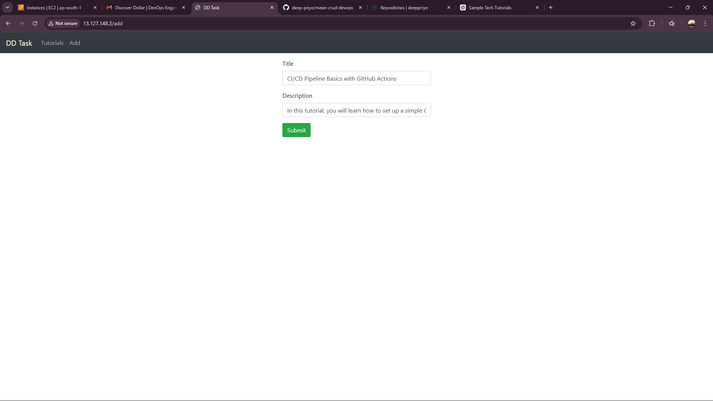
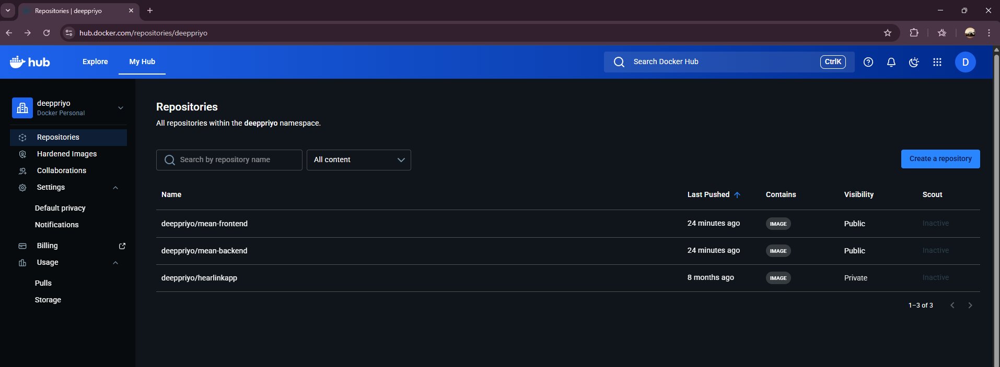
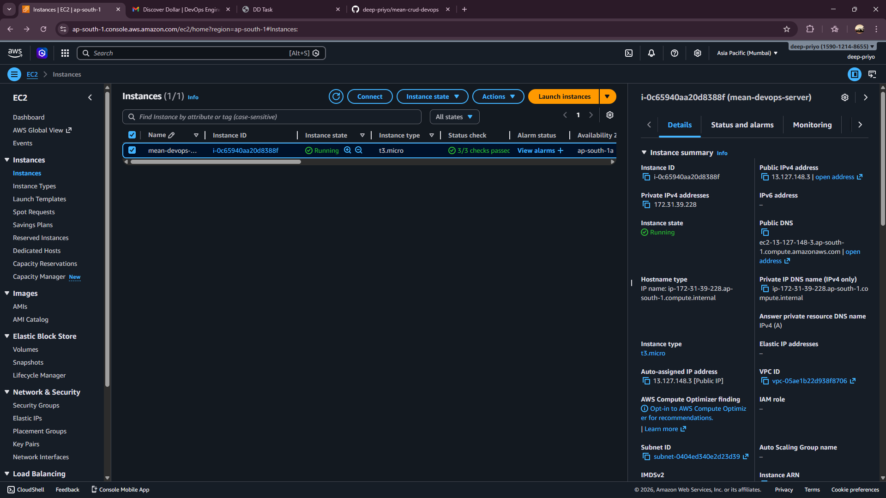
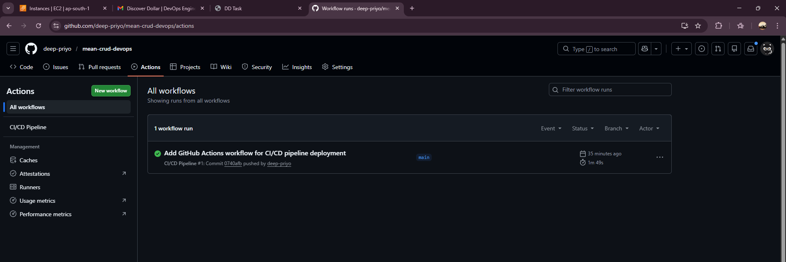
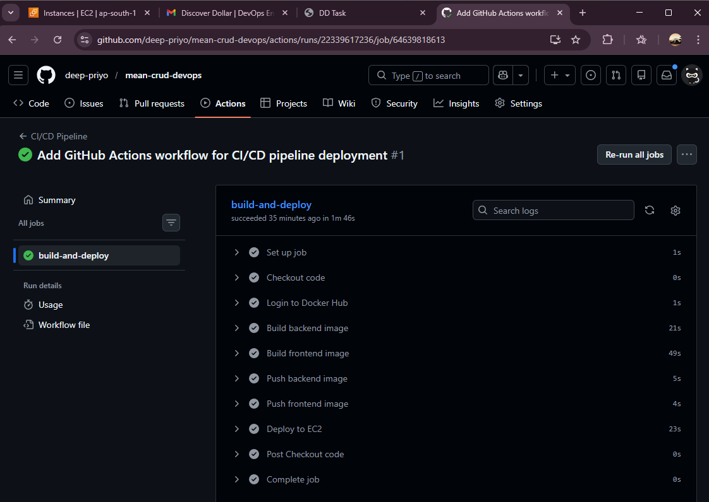
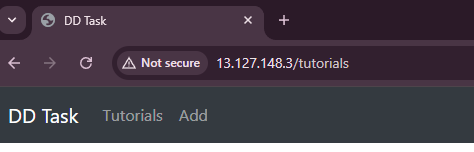

# 🚀 MEAN Stack CRUD Application – DevOps Assignment

## 📌 Project Overview

This project demonstrates the complete containerization, deployment, and automation of a full-stack **MEAN (MongoDB, Express, Angular, Node.js)** application.  
The application manages a collection of tutorials and supports full **CRUD operations** along with search functionality.

The objective of this assignment was to implement a production-ready DevOps workflow including:

* Docker containerization
* Cloud deployment
* Reverse proxy
* CI/CD automation

---

## 🏗️ Architecture Overview


```
Developer → GitHub → GitHub Actions (CI/CD)
        → Docker Hub → AWS EC2 → Docker Compose
        → MongoDB → Backend → Frontend → Nginx Reverse Proxy
```

---

## 🛠️ Tech Stack

### 🔹 Backend

* Node.js
* Express.js
* MongoDB
* Mongoose

### 🔹 Frontend

* Angular 15
* HTTPClient

### 🔹 DevOps & Cloud

* Docker
* Docker Compose
* AWS EC2 (Ubuntu)
* Nginx
* GitHub Actions
* Docker Hub

---

## ✨ Features

✔ Create, Read, Update, Delete tutorials
✔ Search tutorials by title
✔ REST API based architecture
✔ Containerized microservices
✔ Cloud deployment
✔ Reverse proxy on port 80
✔ Automated CI/CD pipeline
✔ Zero manual deployment

---

## 📂 Project Structure

```
crud-dd-task-mean-app
│
├── backend
│   ├── app
│   ├── server.js
│   └── Dockerfile
│
├── frontend
│   ├── src
│   └── Dockerfile
│
├── docker-compose.yml
└── README.md
```

---

## ⚙️ Setup & Installation

### 🔹 Clone the repository

```
git clone https://github.com/deep-priyo/mean-crud-devops
cd mean-crud-devops
```

---

### 🔹 Backend Setup

```
cd backend
npm install
node server.js
```

---

### 🔹 Frontend Setup

```
cd frontend
npm install
ng serve
```

Application runs on:

```
http://localhost:4200
```

---

## 🐳 Docker Containerization

Both frontend and backend are containerized using Docker.

### 🔹 Build images

```
docker build -t <docker-username>/mean-backend ./backend
docker build -t <docker-username>/mean-frontend ./frontend
```

### 🔹 Push to Docker Hub

```
docker push <docker-username>/mean-backend
docker push <docker-username>/mean-frontend
```

---

## ☁️ Cloud Deployment (AWS EC2)

An Ubuntu EC2 instance was configured with:

* Docker
* Docker Compose
* Nginx

The application is deployed using:

```
docker compose up -d
```

MongoDB is deployed as an official Docker container.

---

## 🔄 CI/CD Pipeline

GitHub Actions is configured to automate:

* Docker image build
* Image push to Docker Hub
* Automatic deployment on AWS EC2

### ✔ Pipeline triggers

Every push to the **main branch** triggers:

1. Build updated Docker images
2. Push images to Docker Hub
3. SSH into EC2
4. Pull latest images
5. Restart containers

---

## 🌐 Nginx Reverse Proxy

Nginx is configured to:

* Route frontend and backend traffic
* Expose the application on **port 80**
* Hide internal container ports
* Enable production-style deployment

Users access the system via:
http://<EC2-public-IPv4-address>
---

## 🔐 Security Considerations

✔ Docker containers isolated
✔ MongoDB internal network
✔ SSH secure access
✔ Secrets managed using GitHub Actions
✔ Reverse proxy architecture

## 📸 Screenshots & Demonstration

### 🔹 1. Application UI – Cloud Deployment



This screenshot shows the main dashboard of the MEAN stack CRUD application deployed on AWS EC2.  
The application is accessible through the public IPv4 address and is served via an Nginx reverse proxy on port 80, confirming successful cloud deployment.

---

### 🔹 2. Tutorial Details & Update Operations



This view demonstrates full CRUD functionality. Users can update, publish, or delete tutorials.  
All actions interact with REST APIs built using Node.js and Express, with data persisted in MongoDB running inside Docker containers.

---

### 🔹 3. Add Tutorial – Create Operation



This screenshot confirms the create functionality using the Angular frontend.  
The form submits data to containerized backend services deployed on AWS EC2, validating end-to-end integration of frontend, backend, and database in a cloud environment.

---

### 🔹 4. Docker Images in Docker Hub



This screenshot shows the Docker images for frontend and backend stored in Docker Hub.  
These images are automatically built and pushed using GitHub Actions as part of the CI/CD workflow.

---

### 🔹 5. Running Containers on AWS EC2



This confirms that all application services (frontend, backend, and MongoDB) are running successfully on the AWS EC2 instance using Docker Compose.

---

### 🔹 6. GitHub Actions CI/CD Workflow



This screenshot shows the automated CI/CD pipeline execution.  
It includes image build, push to Docker Hub, and automated deployment to the cloud infrastructure.

---

### 🔹 7. Successful Deployment Logs



This demonstrates the successful completion of the automated deployment process, including remote container updates and service restart on EC2.

---

### 🔹 8. Nginx Reverse Proxy Configuration



This confirms that the application is served through an Nginx reverse proxy on port 80.  
Internal container ports are hidden, providing a production-style architecture and improved security.

## 📊 Why This Approach

This project demonstrates a production-ready DevOps workflow:

* Scalable architecture
* Automated deployment
* Containerized services
* Cloud-ready
* High availability

This approach ensures:
✔ Faster deployment
✔ Reduced manual errors
✔ Improved scalability
✔ Easy maintenance

---

## 🚀 Future Improvements

* HTTPS with SSL
* Domain configuration
* Kubernetes deployment
* Monitoring with Prometheus & Grafana
* Load balancing
* Blue-Green deployment

---

## 👨‍💻 Author

**P M**
DevOps | Full-Stack | Cloud | Automation

---

## 📬 Contact

Feel free to reach out for any queries or collaboration.

---

⭐ Thank you for reviewing this project!
